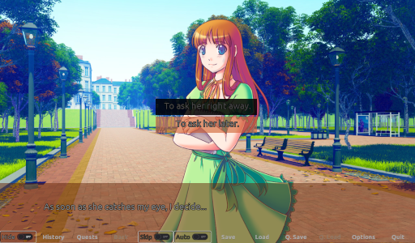

# About

## This are Docs for Rakugo Framework



Inspired by [Ren'Py](https://www.renpy.org),
Rakugo is a framework aimed at providing a better
toolset for narrative-based games on
[Godot](https://godotengine.org).
Simplify your project, if it is a visual novel,
point and click, RPG, interactive text game or
many other styles and blends of styles.

```{toctree}
---
maxdepth: 2
caption: Tutorials
---
project_setup.md
dialogue_node.md
text.md
changing_scenes.md
```
