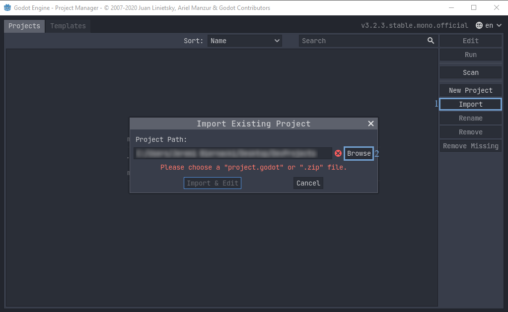
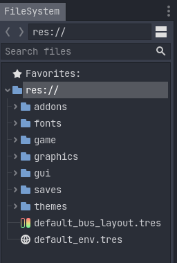
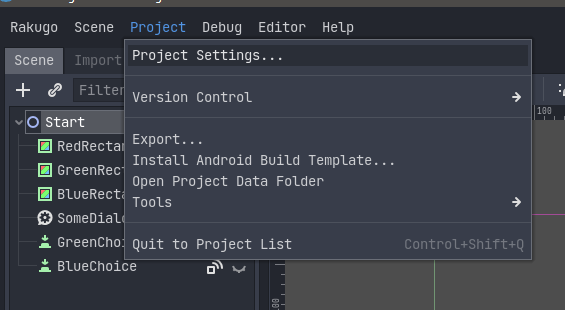
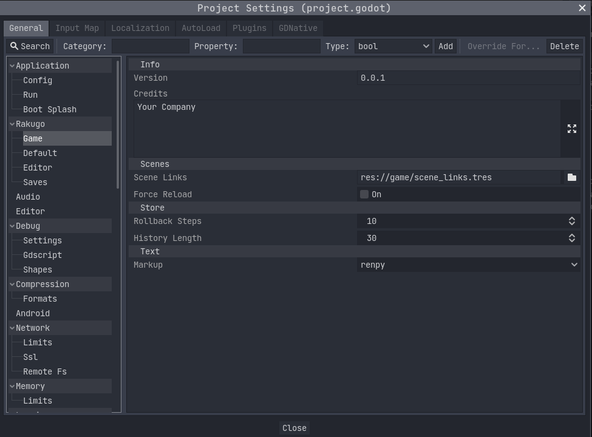

# Project Setup

```{admonition} Info
:class: note

This tutorial base on my conversation with [noodulz](https://noodulz.itch.io)
creator of [Light Letters](https://noodulz.itch.io/light-letters-demo) using Rakugo.
This part will tell you how to start with new Rakugo Project.
```

## Create Rakugo Project

1. [Godot Engine](https://godotengine.org/download) needs to be downloaded and installed.
2. Download [Rakugo](https://rakugoteam.github.io/download/) from official sources.
3. Open Godot and use the Import button to your right, then browse your files to find the Rakugo ZIP.



```{admonition} Warning
:class: warning

Godot will load the Rakugo template, but there is a known, easy to fix issue.
Due to how Godot 3.x currently loads add-ons, it will not start Rakugo correctly the first time.
Simply close the project or restart Godot then reopen to load Rakugo correctly.
The shortcut for closing a project is **Ctrl + Shift + Q**.
```

## Project Structure

```{admonition} Note
:class: Note

The FileSystem tab is your main hub, should only use this tab to change names or move files for your project.
```



- _addons/Rakugo/_ - the core code of Rakugo. You should leave this alone unless you know what you're doing.
- _fonts_ - fonts assets used by GUI for text displays.
- _game_ - Most of your game code and assets should be here.
- _graphics_ - Graphical assets used by Rakugo
- _gui_ - Your highly customizeable GUI. It can be used for whatever GUI a creator can think of.
- _themes_ - Obsolete GUI themes from older Rakugo versions that will be removed or replaced in future versions.

## Rakugo Project Settings

To change game settings for your project, select _Project > Project Settings_



here is a new Rakugo category for the add-on content.
There are some obsolete options that will be fully removed in a future update.



### Obsolete Settings

- _rakugo/game/info/credits_
- _rakugo/editor/debug_

### Basic Settings

- _rakugo/game/scenes/scene_links_ - this setting tells rakugo where is [SceneLinks resource, more about it here](changing_scenes.md).
- _rakugo/game/text/markup_ - markup langue used in dialogue [more markup it here](text.md)
- _rakugo/saves/test_mode_ - if set true, save files will be saved as
  text files in your project folder for ease of testing. Set it to false before export.
- _rakugo/saves/save_folder_ - it is the path for the project's save folder.
  Before exporting, change it to start from _user://_ instead of _res://_
