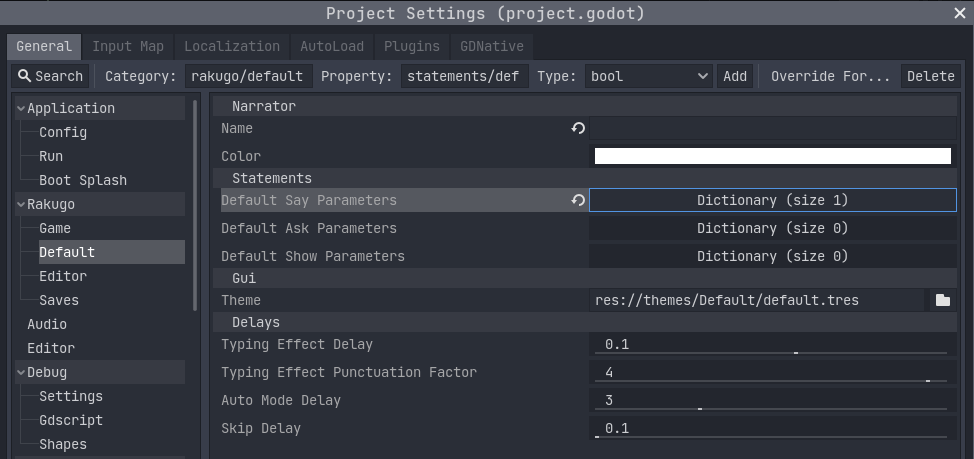

# Project Setup

```{admonition} Info
:class: note

This tutorial base on my conversation with [noodulz](https://noodulz.itch.io)
creator of [Light Letters](https://noodulz.itch.io/light-letters-demo) using Rakugo.
This part will tell you how to start with new Rakugo Project.
```

## Create Rakugo Project

1. [Godot Engine](https://godotengine.org/download) needs to be downloaded and installed.
2. Download [Rakugo](https://rakugoteam.github.io/download/) from official sources.
3. Open Godot and use the Import button to your right, then browse your files to find the Rakugo ZIP.


```{warning}

Godot will load the Rakugo template, but there is a known, easy to fix issue.
Due to how Godot 3.x currently loads add-ons, it will not start Rakugo correctly the first time.
Simply close the project or restart Godot then reopen to load Rakugo correctly.
The shortcut for closing a project is **Ctrl + Shift + Q**.
```

## Project Structure

```{note}

The FileSystem tab is your main hub, should only use this tab to change names or move files for your project.
```


- _addons/Rakugo/_ - the core code of Rakugo. You should leave this alone unless you know what you're doing.
- _fonts_ - fonts assets used by GUI for text displays.
- _game_ - Most of your game code and assets should be here.
- _graphics_ - Graphical assets used by Rakugo
- _gui_ - Your highly customizeable GUI. It can be used for whatever GUI a creator can think of.
- _themes_ - Obsolete GUI themes from older Rakugo versions that will be removed or replaced in future versions.

## Rakugo Project Settings

To change game settings for your project, select _Project > Project Settings_


Here is a new Rakugo category for the add-on content.
There are some obsolete options that will be fully removed in a future update.


### Obsolete Settings

- _rakugo/game/info/credits_
- _rakugo/editor/debug_
- _rakugo/default/gui/theme_

### Game Settings

- _rakugo/game/info/version_ - current version of your game
- _rakugo/game/text/markup_ - markup langue used in dialogue [more markup it here](text.md)

- _rakugo/game/scenes/scene_links_ - this setting tells rakugo where is [SceneLinks resource, more about it here](changing_scenes.md). This can be use for dlcs and mods.
- _rakugo/game/scenes/force_reload_ - should rakugo force reload scene on jump between dialogue events
- _rakugo/game/store/rollback_steps_ - how many rollback steps can be done
- _rakugo/game/store/history_length_ - how long history log is displayed

### Default Functions Arguments Settings



#### Narrator

Character used when `say()` is called with `character_tag = null`.

- _rakugo/default/narrator/name_
- _rakugo/default/narrator/color_

#### Delays

- _rakugo/default/delays/typing_effect_delay_ - time between _typing_ next letter when `typing_effect = true`
- _rakugo/default/delays/typing_effect_punctuation_factor_ - how long wait after punctuation before continue _typing_ effect
- _rakugo/default/delays/auto_mode_delay_ - how long does the step take on _auto mode_
- _rakugo/default/delays/skip_delay_ - how long does the step take on _skip mode_

#### Statements

- _rakugo/default/statements/default_say_parameters_ - default additional parameters for `say()` statement
- _rakugo/default/statements/default_ask_parameters_ - default additional parameters for `ask()` statement
- _rakugo/default/statements/default_show_parameters_ - default additional parameters for `show()` statement

### Save Settings

<!-- todo add screen shot -->

- _rakugo/saves/test_mode_ - if set true, save files will be saved as
  text files in your project folder for ease of testing. Set it to false before export.
- _rakugo/saves/save_folder_ - it is the path for the project's save folder.
  Before exporting, change it to start from _user://_ instead of _res://_
- _rakugo/saves/save_screen_layout_ - how to displays saves in pause menu,
  there are 2 build modes for this:
  - _save_pages_ - use grid and pages, similar to **Ren'Py** way of displaying saves
  - _save_list_ - use vertical list of saves, similar to **RPGMaker** way of displaying saves
