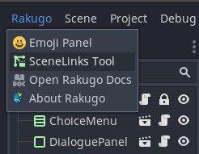
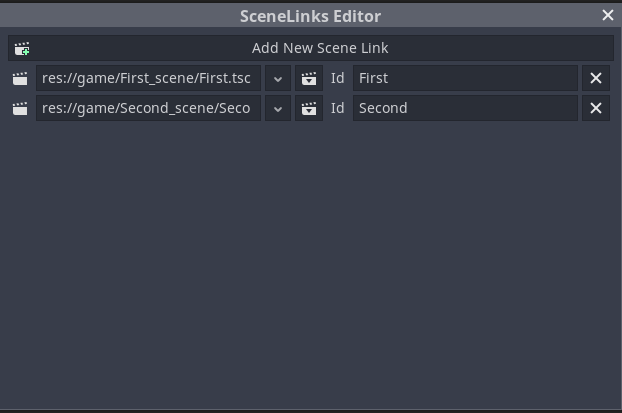
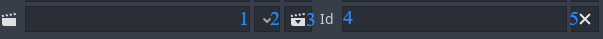

# Changing Scenes

## Adding scene to SceneLinks

If you want to change scene in game first you have to add it to **SceneLinks** file.

```{note}

Main scene of your game also need to be in *SceneLinks*
```

To do that open _Rakugo_ menu and choose _SceneLinks_



Now this window will appear:



Click on _Add New Scene Link_ button and new entery will appear.



1. Place to set path to scene
2. List of current opened scenes to choose path from
3. Click this button browse for scene
4. Place to set **Id** for scene that will be used on changing scene
5. Click this button to remove entery

Set path to scene (using **1.** , **2.** or **3.**) and scene **Id**.

## Changing scene in code

Now you can change scenes using one of two ways:

### Load_Scene

```{note}

Use this way if scene you change to doesn't have any **Dialogues** Nodes.
```

```gdscript
Rakugo.load_scene("scene_id", force_reload = false)
```

### Jump

```{tip}

[You can read more about `jump()` here](dialogue_node.html#jumping-between-dialogue-events).
```

```{note}

Use this way if scene you change to has any **Dialogues** Nodes.
```

```gdscript
jump("scene_id", "", "")
```
