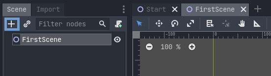
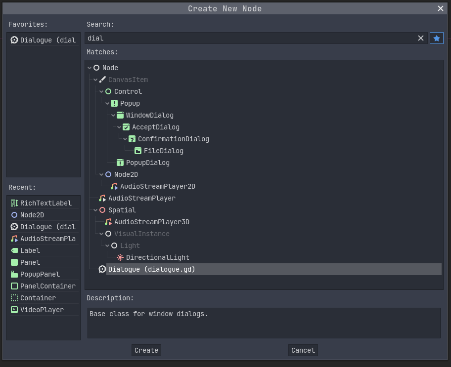
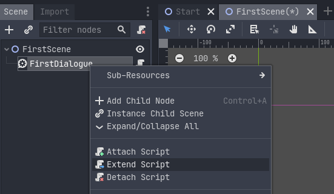
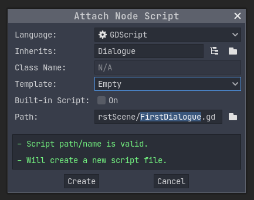
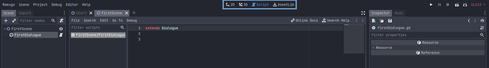
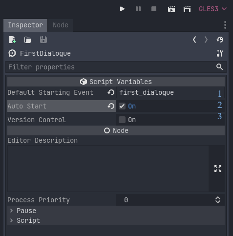

# Dialogue Node

```{note}

Scene with dialogue need to be added to [SceneLinks](changing_scenes.md) to works
```

To add new Node to scene you can clicking on plus icon or **A + Ctrl**.



The window for choosing the type of node will appear, type _dialogue_ (or part of it) in the search box to find it easier and click on it.

```{tip}

You can click on the star icon to add it to your favorite nodes, for easier access in the future.
```



Now click the _Create_ button at bottom of this window.

## Setup Dialogue for Editing

```{note}

You should change the name of the **Dialogue** node, as there will likely be many nodes of this type in scene.
To do this double click on its name in scene hierarchy.
```

To write our own dialogue in it, you to first extend it.
To do it right click on node and choose _Extend Script_.



The Create Script window will appear.



Change **Template** to _Empty_.

```{note}

By default path to save script is set to the same folder as the scene and the name of script is the same as the node.
```

The center Godot editor window will switch to script editor.



```{tip}

You can always change the mode of the editor center by clicking on the icons in the top center of the window.
```

## Create Dialogue event

**Dialogue event** is Rakugo's term for special func, this func should look like this:

```gdscript
func sample():
  start_event("sample")

  say(null, "This is sample of dialogue event.")
  step() # stop func and waits for player interaction

  say(null, "Another line of dialogue.")
  step()

  end_event()
```

## Dialogue Node Inspector

Look at the _FirstDialogue_ node _Inspector_ tab.



1. Set **Default Starting Event** to dialogue event name to start from by default
2. Set **Auto Start** to true if this is dialogue from which Scene should by default
3. Set this to true if there are important changes in this dialogue between version of your game.

```{warning}

On one Scene can be only one **Dialogue** node with `auto_start = true`.
```

## Jumping between dialogue events

You can jump between dialogue events few different ways:

- jump to different dialogue event in the same **Dialogue** node

  ```gdscript
  jump("", "", "dialogue_event")
  ```

- jump to default dialogue event in other **Dialogue** node

  ```gdscript
  jump("", "dialogue_node_name", "")
  # or
  dialogue_node.start()
  ```

- jump to different dialogue event in other **Dialogue** node

  ```gdscript
  jump("", "dialogue_node_name", "dialogue_event")
  ```

- jump to default dialogue event in other scene

  ```gdscript
  jump("scene_id", "", "")
  ```

- jump to default dialogue event in other scene from not default **Dialogue** node
  ```gdscript
  jump("scene_id", "dialogue_node_name", "")
  ```
- jump to not default one dialogue event in other scene that on not default **Dialogue** node
  ```gdscript
  jump("scene_id", "dialogue_node_name", "dialogue_event")
  ```
