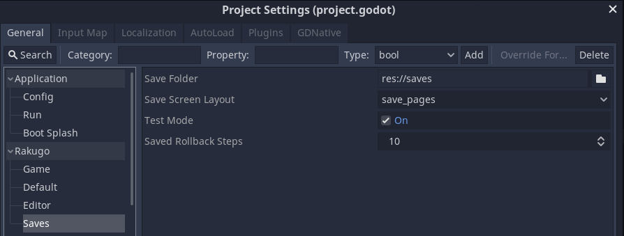
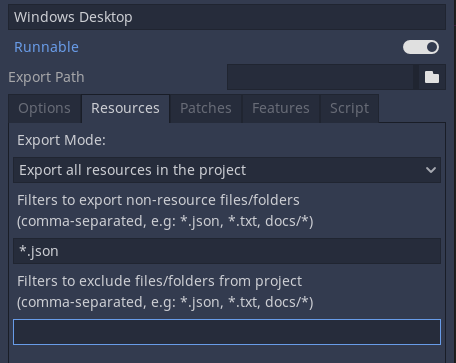
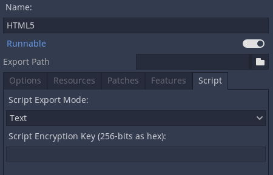
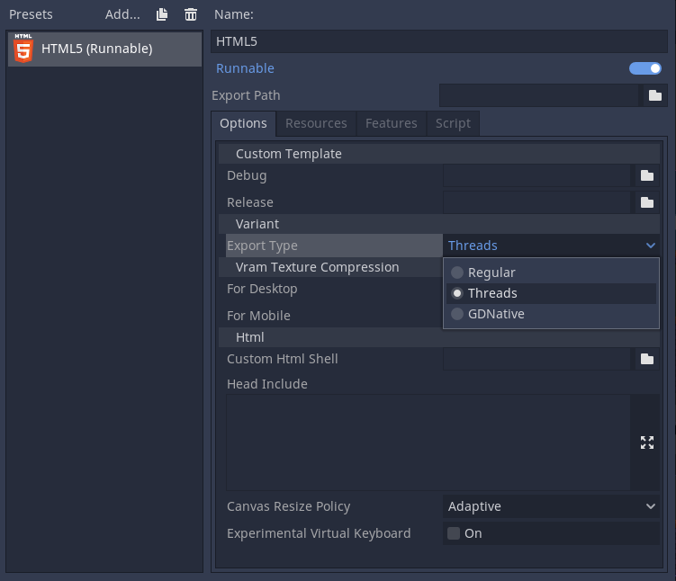

# How To Export Project

## Project Settings

Before Export some Project Settings need to be changed:



- _rakugo/saves/test_mode_ - Set it to `false` before export.
- _rakugo/saves/save_folder_ - it is the path for the project's save folder.
  Before exporting, change it to start to _user://_ instead of _res://_

## Export menu

After many attempts at different export workflows, the current one has proven to work the best.
At the time of this writing, not all platforms are supported yet, but the supported platforms continue to grow.

To open the export menu, click the **Export** button:


The export menu will open, however it will be completely empty.


That is because we need to add an export preset.
To do that click the **Add..** button at the top of the export menu.
This will open a drop down list of platforms to choose from for an export preset.


The default options are often enough to export, so tweaking them is not necessary, but provide extra control.
However, many platforms require additional tools (SDKs) to be installed to be able to export.
Additionally, Godot needs export templates installed to create packages.
The export menu will complain when something is missing and will not allow the user to export for that platform until they resolve it:


At that time, the user is expected to come back to the documentation and follow instructions on how to properly set up that platform.

## Export templates

Apart from setting up the platform, the export templates must be installed to be able to export projects.
They can be obtained as a .tpz (a renamed .zip) file from the [Godot download page website](https://www.godotengine.org/download).

Once downloaded, they can be installed using the “Install Export Templates” option in the editor:


## Export Settings

We need add _\*.json_ files, for emojis to work,


change script export mode in the export settings from compiled to text



```{note}
[More about Exporting in Godot here.](https://docs.godotengine.org/en/3.3/getting_started/workflow/export/index.html)
```

### For HTML Export

```{note}
You need Godot (standard) in version 3.3 for HTML export work correct for Rakugo.
```

You need to set **Export Type** to **Threads**.


