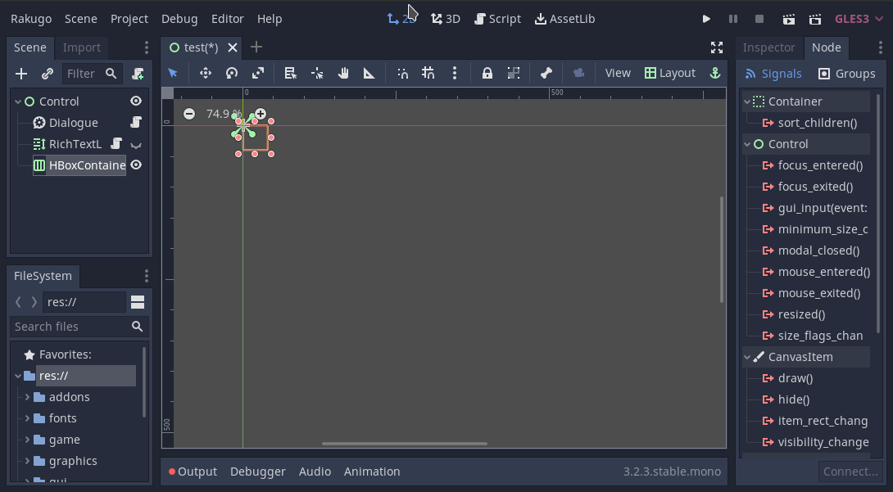
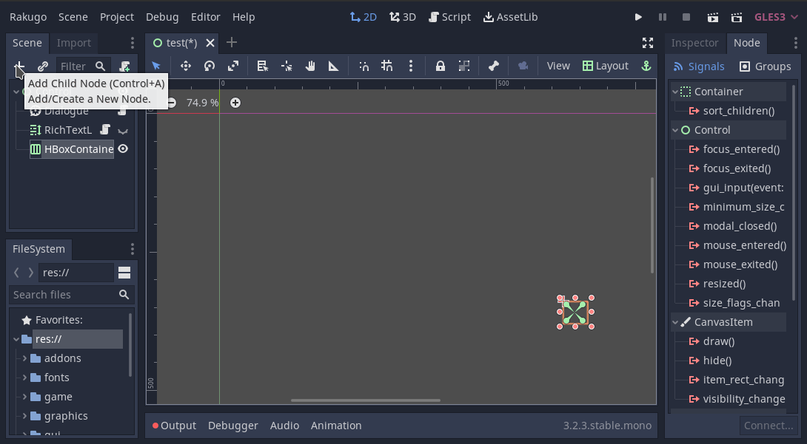

# Menus in Game

## Menu Statement in Dialogue

```gdscript
var choice = menu(array_of_choices, parameters)
```

1. Array of choices every choice is 3 element list like this:
   ```gdscript
   ["choice label", variable_to_return, parameters]
   ```
   1. Choice label that can use chosen [markup](text.md).
   1. Variable to return when this choice is chosen.
   1. Additional parameters in from of dictionary, default empty. Build in parameters:
      - `visible` - can show/hide choice from player if true/false.
1. Additional parameters in from of dictionary, default empty.
   There are no build in parameters for this statement

Example of menu:

```gdscript
say (null , "Choose one option.")
var choice = menu([
    ["A", "a", {}],
    ["B", "b", {}],
])
```


```gdscript
# continuation of the previous script
if cond(choice == 1):
  say(null, "You choose First choice")

elif cond(choice == 2):
  say(null, "You choose Second choice")

say (null , "Choose another option.")
var choice = menu([
    ["Only visible if \"A\" was chosen", 1, {"visible":choice == "a"}],
    ["Only visible if \"B\" was chosen", 2, {"visible":choice == "b"}],
    ["Always visible", 3, {}],
])
```


## Custom Menus

To crate custom menu use **Container** node like:

- **VBoxContainer**
- **HBoxContainer**
- **GridContainer**

```{tip}
Use **Layout** menu to set layout of container

```

Add some **Buttons** to **Container**:


```{tip}
Use `Ctrl + D` shortcut to duplicate chosen node.
```



Then click on button and open **Node** tab (by default next to **Inspector** tab).
Go to sub-tab **Signals** and choose `pressed()`.


Now this window will show up.


1. Choose to which node connect signal (only nodes with script)
1. Name of function that will called on this signal
1. Click button **Connect** to apply this changes

Apply this changes will:

- add icon that this button has connected signal


- add new empty function to chosen node script


Edit body of this function how ever you want.

```{note}
Don't edit connected method name after it is created,
it will break the connection.
```
