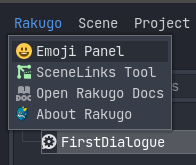
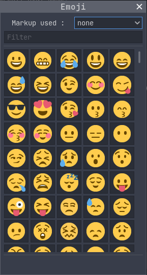
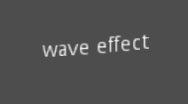
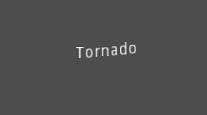
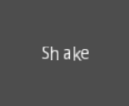
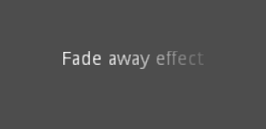
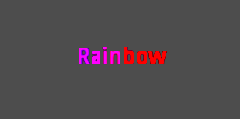
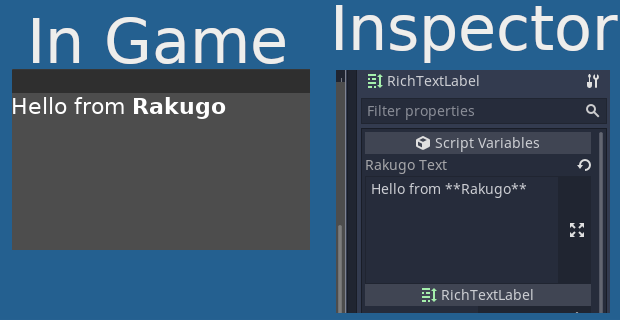

# Text

In **Dialogue** node you can use one of supported markups with functions: `say()`, `ask()` and `menu()`. You can use it in ui also [here how](#use-markup-in-ui).
You can set default markup in [**ProjectSettings**](project_setup.html#basic-settings).

## Reference

:::{tabbed} markdown

| Command           | Tag                             | Description                                                                |
| ----------------- | ------------------------------- | -------------------------------------------------------------------------- |
| **bold**          | `**text**`                      | Makes text bold.                                                           |
| **italics**       | `*text*`                        | Makes text italics.                                                        |
| **underline**     | `[u]text[/u]`                   | Makes text underline.                                                      |
| **strikethrough** | `~~text~~`                      | Makes text strikethrough.                                                  |
| **code**          | `` `text` ``                    | Makes text use the code font (which is typically monospace).               |
| **center**        | `[center]text[/center]`         | Makes text horizontally centered.                                          |
| **right**         | `[right]text[/right]`           | Makes text horizontally right-aligned.                                     |
| **fill**          | `[fill]text[/fill]`             | Makes text fill the RichTextLabel's width.                                 |
| **indent**        | `[indent]text[/indent]`         | Increase the indentation level of text.                                    |
| **url**           | `protocol://url`                | Show url as such, underline it and make it clickable.                      |
| **variable**      | `<variable>`                    | Put `variable` as string in text, variable must be added to `Rakugo.store` |
| **emoji**         | `:emoji:`                       | Insert emoji image.                                                        |
| **image**         | ``                     | Insert image at resource path.                                             |
| **resized image** | `[img=width]path[/img]`         | Insert image at resource path using width (keeps ratio).                   |
| **resized image** | `[img=widthxheight]path[/img]`  | Insert image at resource path using `width×height`.                        |
| **font**          | `[font=path]text[/font]`        | Use custom font at path for text.                                          |
| **color**         | `[color=code/name]text[/color]` | Change text color; use name or `#` format, such as `#ff00ff`.              |
| **table**         | `[table=number]cells[/table]`   | Creates a table with number of columns.                                    |
| **cell**          | `[cell]text[/cell]`             | Adds cells with the text to the                                            |

:::

:::{tabbed} markdown_simple

| Command           | Tag              | Description                                                                |
| ----------------- | ---------------- | -------------------------------------------------------------------------- |
| **bold**          | `**text**`       | Makes text bold.                                                           |
| **italics**       | `*text*`         | Makes text italics.                                                        |
| **underline**     | `[u]text[/u]`    | Makes text underline.                                                      |
| **strikethrough** | `~~text~~`       | Makes text strikethrough.                                                  |
| **code**          | `` `text` ``     | Makes text use the code font (which is typically monospace).               |
| **url**           | `protocol://url` | Show url as such, underline it and make it clickable.                      |
| **variable**      | `<variable>`     | Put `variable` as string in text, variable must be added to `Rakugo.store` |
| **emoji**         | `:emoji:`        | Insert emoji image.                                                        |
| **image**         | ``      | Insert image at resource path.                                             |

:::

:::{tabbed} renpy

| Command           | Tag                             | Description                                                                |
| ----------------- | ------------------------------- | -------------------------------------------------------------------------- |
| **bold**          | `{b}text{/b}`                   | Makes text bold.                                                           |
| **italics**       | `{i}text{/i}`                   | Makes text italics.                                                        |
| **underline**     | `{u}text{/u}`                   | Makes text underline.                                                      |
| **strikethrough** | `{s}text{/s}`                   | Makes text strikethrough.                                                  |
| **code**          | `{code}text{/code}`             | Makes text use the code font (which is typically monospace).               |
| **center**        | `{center}text{/center}`         | Makes text horizontally centered.                                          |
| **right**         | `{right}text{/right}`           | Makes text horizontally right-aligned.                                     |
| **fill**          | `{fill}text{/fill}`             | Makes text fill the RichTextLabel's width.                                 |
| **indent**        | `{indent}text{/indent}`         | Increase the indentation level of text.                                    |
| **url**           | `{url}url{/url}`                | Show url as such, underline it and make it clickable.                      |
| **variable**      | `<variable>`                    | Put `variable` as string in text, variable must be added to `Rakugo.store` |
| **emoji**         | `{:emoji:}`                     | Insert emoji image.                                                        |
| **image**         | `{img}path{/img}`               | Insert image at resource path.                                             |
| **resized image** | `{img=width}path{/img}`         | Insert image at resource path using width (keeps ratio).                   |
| **resized image** | `{img=widthxheight}path{/img}`  | Insert image at resource path using `width×height`.                        |
| **font**          | `{font=path}text{/font}`        | Use custom font at path for text.                                          |
| **color**         | `{color=code/name}text{/color}` | Change text color; use name or `#` format, such as `#ff00ff`.              |
| **table**         | `{table=number}cells{/table}`   | Creates a table with number of columns.                                    |
| **cell**          | `{cell}text{/cell}`             | Adds cells with the text to the                                            |

:::

:::{tabbed} bbcode

| Command           | Tag                             | Description                                                                |
| ----------------- | ------------------------------- | -------------------------------------------------------------------------- |
| **bold**          | `[b]text[/b]`                   | Makes text bold.                                                           |
| **italics**       | `[i]text[/i]`                   | Makes text italics.                                                        |
| **underline**     | `[u]text[/u]`                   | Makes text underline.                                                      |
| **strikethrough** | `[s]text[/s]`                   | Makes text strikethrough.                                                  |
| **code**          | `[code]text[/code]`             | Makes text use the code font (which is typically monospace).               |
| **center**        | `[center]text[/center]`         | Makes text horizontally centered.                                          |
| **right**         | `[right]text[/right]`           | Makes text horizontally right-aligned.                                     |
| **fill**          | `[fill]text[/fill]`             | Makes text fill the RichTextLabel's width.                                 |
| **indent**        | `[indent]text[/indent]`         | Increase the indentation level of text.                                    |
| **url**           | `[url]url[/url]`                | Show url as such, underline it and make it clickable.                      |
| **variable**      | `<variable>`                    | Put `variable` as string in text, variable must be added to `Rakugo.store` |
| **code**          | `[code]text[/code]`             | Makes text use the code font (which is typically monospace).               |
| **center**        | `[center]text[/center]`         | Makes text horizontally centered.                                          |
| **right**         | `[right]text[/right]`           | Makes text horizontally right-aligned.                                     |
| **fill**          | `[fill]text[/fill]`             | Makes text fill the RichTextLabel's width.                                 |
| **indent**        | `[indent]text[/indent]`         | Increase the indentation level of text.                                    |
| **url**           | `[url]url[/url]`                | Show url as such, underline it and make it clickable.                      |
| **url (ref)**     | `[url=url]text[/url]`           | Makes text reference url (underlined and clickable).                       |
| **emoji**         | `[:emoji:]`                     | Insert emoji image.                                                        |
| **image**         | `[img]path[/img]`               | Insert image at resource path.                                             |
| **resized image** | `[img=width]path[/img]`         | Insert image at resource path using width (keeps ratio).                   |
| **resized image** | `[img=widthxheight]path[/img]`  | Insert image at resource path using `width×height`.                        |
| **font**          | `[font=path]text[/font]`        | Use custom font at path for text.                                          |
| **color**         | `[color=code/name]text[/color]` | Change text color; use name or `#` format, such as `#ff00ff`.              |
| **table**         | `[table=number]cells[/table]`   | Creates a table with number of columns.                                    |
| **cell**          | `[cell]text[/cell]`             | Adds cells with the text to the                                            |

:::

## Escape Characters

You can use `\` (backslash) in text as escape character.
Its (mostly) _turns off_ markup for character after it.

- `\"` (backslash-doublequote)
  Includes a doublequote in a double-quoted string.
- `\'` (backslash-quote)
  Includes a single quote in a single-quoted string.
- `\n` (backslash-n)
  Includes a newline character in the text.
- `\\` (backslash-backslash)
  Includes a backslash character in the text.
- `\[` (backslash-left bracket)
  Includes a left bracket character in the text.
- `\]` (backslash-right bracket)
  Includes a right bracket character in the text.
- `\{` (backslash-left brace)
  Includes a left brace character in the text.
- `\}` (backslash-right brace)
  Includes a right brace character in the text.
- `\<` (backslash-mathematical minority sign)
  Includes a mathematical minority sign character in the text.
- `\>` (backslash-mathematical majority sign)
  Includes a mathematical majority sign character in the text.

## Emojis

To see what are build in emojis open **Emoji Panel**.



This window will popup:



Can set used markup.
Filter to find emoji.
When clicked on emoji it will copy it with chosen markup to system clipboard. This can be pasted into Dialogue.

For example:

:::{tabbed} markdown

```gdscript
say("cool", "I'm cool :sunglasses: Developer")
```

:::

:::{tabbed} bbcode / renpy

```gdscript
say("cool", "I'm cool [:sunglasses:] Developer")
```

:::


## Built-in color names

List of valid color names for use with:

:::{tabbed} markdown / bbcode

```
[color=name]
```

:::

:::{tabbed} renpy

```
{color=name}
```

:::

- <p style="color:aqua">aqua</p>
- <p style="color:black">black</p>
- <p style="color:blue">blue</p>
- <p style="color:fuchsia">fuchsia</p>
- <p style="color:gray">gray</p>
- <p style="color:green">green</p>
- <p style="color:lime">lime</p>
- <p style="color:maroon">maroon</p>
- <p style="color:navy">navy</p>
- <p style="color:purple">purple</p>
- <p style="color:red">red</p>
- <p style="color:silver">silver</p>
- <p style="color:teal">teal</p>
- <p style="color:white">white</p>
- <p style="color:yellow">yellow</p>

## Hexadecimal color codes

For opaque RGB colors, any valid 6-digit hexadecimal code is supported.

For example:

:::{tabbed} markdown / bbcode

```
[color=#ffffff]white[/color]
```

:::

:::{tabbed} renpy

```
{color=#ffffff}white{/color}
```

:::

For transparent RGB colors, any 8-digit hexadecimal code can be used.
In this case, note that the alpha channel is the
**first** component of the color code, not the last one.

For example:

:::{tabbed} markdown / bbcode

```
[color=#88ffffff]translucent white[/color]
```

:::

:::{tabbed} renpy

```
{color=#88ffffff}translucent white{/color}
```

:::

## Animation effects

BBCode/Markdown/RenPy markup can also be used to create different text animation effects.
Five customizable effects are provided out of the box.

<!-- , you can easily create your own when used with gui. -->

### Wave



Wave makes the text go up and down. Tag format is:

:::{tabbed} markdown / bbcode

```
[wave amp=50 freq=2]wave[/wave]
```

:::

:::{tabbed} renpy

```
{wave amp=50 freq=2}wave{/wave}
```

:::

Where `amp` controls how high and low the effect goes,
and `freq` controls how fast the text goes
up and down.

### Tornado



Tornado makes the text move around in a circle. Tag format is:

:::{tabbed} markdown / bbcode

```
[tornado radius=5 freq=2]tornado[/tornado]
```

:::

:::{tabbed} renpy

```
{tornado radius=5 freq=2}tornado{/tornado}
```

:::

Where `radius` is the radius of the circle that
controls the offset, `freq` is how fast the
text moves in a circle.

### Shake



Shake makes the text shake. Tag format is:

:::{tabbed} markdown / bbcode

```
[shake rate=5 level=10]shake[/shake]
```

:::

:::{tabbed} renpy

```
{shake rate=5 level=10}shake{/shake}
```

:::

Where`rate` controls how fast the text shakes, `level` controls how far the text is offset from the origin.

### Fade



Fade creates a fade effect over the text that is not animated. Tag
format is:
::: {tabbed} markdown / bbcode

```
[fade start=4 length=14]fade[/fade]
```

:::

::: {tabbed} renpy

```
{fade start=4 length=14}fade{/fade}
```

:::

Where `start` controls the starting position of the
falloff relative to where the fade command is inserted,
`length` controls over how many characters should the
fade out take place.

### Rainbow



Rainbow gives the text a rainbow color that changes over time. Tag
format is:
::: {tabbed} markdown / bbcode

```
[rainbow freq=0.2 sat=10 val=20]rainbow[/rainbow]
```

:::

::: {tabbed} renpy

```
{rainbow freq=0.2 sat=10 val=20}rainbow{/rainbow}
```

:::

Where `freq` is the number of full rainbow cycles per second,
`sat` is the saturation of the rainbow,
`val` is the value of the rainbow.

## Use Markup in UI

```{note}

This can change in future versions.
```

To use markup with ui you need to use **RichTextLabel** to display it.
It supports bbcode without `<value>` out of the box.
You only need set `enable_bbcode` to `true`.

If you want to use other markup with it add to it script like this:

```{note}

You can use `tool` keyword to update text preview in editor,
but Rakugo text passer don't work well with it, so we don't recommend using it for now.
```

```gdscript
extends RichTextLabel

# this line add multiline text editor for value in Inspector
export(String, MULTILINE) var rakugo_text := "text to parse"

func _ready() -> void:
  bbcode_enabled = true
    bbcode_text = Rakugo.parse_rich_text(rakugo_text)
```


