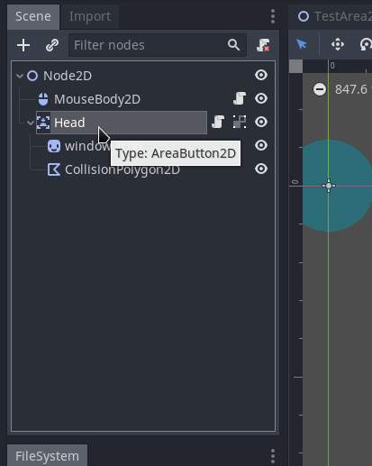
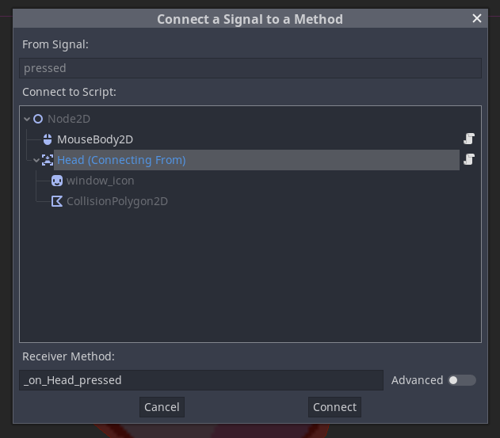

# Clickable Areas

```{note}
You need at least Rakugo 3.2.1 for this.
```

## Prepare Scene

1. Crate new 2D scene or open one to which you want to add clickable areas.
   

1. Add **MouseBody2D** Node to scene
   

## Crate Clickable Area

1. Add **AreaButton2D** to scene
   

1. Add sprite to it if needed

1. Use **CollisionPolygon2D** to define clickable area
   

## Scripting

1. Should change name of **AreaButton2D** to more meaning full
   (In this example I changed it to name to _Head_)

1. Extend **AreaButton2D** script



3. Now content it to _pressed_ signal




4. Edit Script as you want in `_on_<NodeName>_pressed` function

```gdscript
extends AreaButton2D

func _on_Head_pressed():
	pass # Replace with function body.
```

For example if you have Dialogue node attached to this **AreaButton2D**
you can start dialogue like this:

```gdscript
extends AreaButton2D

func _on_Head_pressed():
	$Dialogue.start("dialogue_event_to_start")
```
