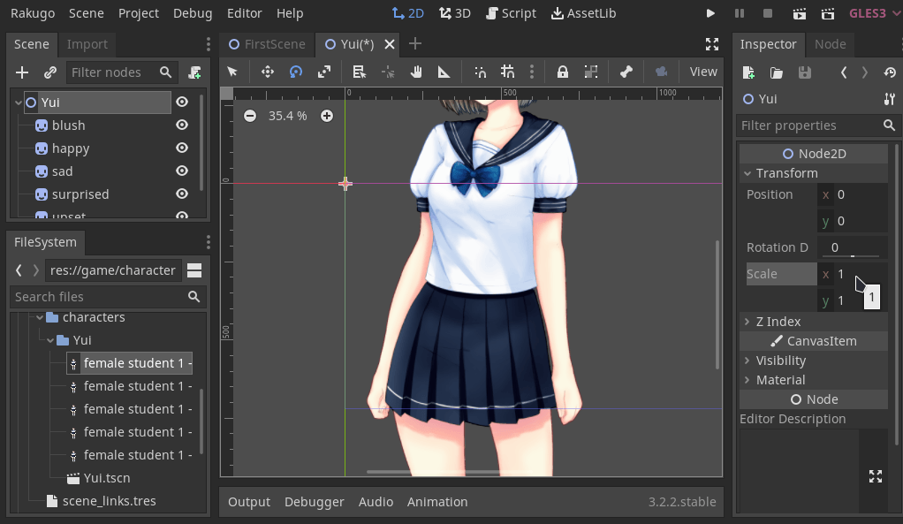

# Show and Hide Tutorial

This tutorial is based on my conversation with [noodulz](https://noodulz.itch.io) creator of [Light Letters](https://noodulz.itch.io/light-letters-demo) using Rakugo.

This tutorial will show you how to use `show()` and `hide()` funcs in Dialogue.

**_Updated for Rakugo 3.1.0_**

## Import Assets

First we need add to our scene something that we can show or hide.
In can be any type of node, if we set and script it correct.

In this example we will use [this free character sprite](https://liah0227.itch.io/female-student-1).

Open your Rakugo project then move folder with sprites to _game/characters_ (if you don't have this folder create it).


After that godot will start importing this assets.

## Prepare Scene

When godot finish importing click on plus icon to create new scene.


For my case we choose **2D Scene** as scene type.


Now change root Node name to character name, we will call mine _Yui_.


Then we change name of asset folder to reflect that.


Now we save scene to _game/characters/Yui_ as _Yui.tscn_.


After that we select all assets and drag them in to scene.


## Before adding tags

To make our scene more readable and easier to script we use _Batch Rename_ tool for just added nodes.

1. Copy repeating part of nodes name
1. Select nodes that names we want to change
1. Right click on them then choose _Batch Rename_
1. Use tool


Our character is too big for as, but we can easy fix this.
Just choose root node and change scale.



## Adding tags

Now we need to select root node and add it to `showable` group with some tags.
Tags are special types of groups that names will be auto converted at runtime.
Tags starts with `$`, they can use `#` for node name and `*` for wildcard.

To start select any node then switch to _Node_ tab on side and then to it subtab _Groups_.
Then click button _Manage Groups_ - this tool allows us to easy add many nodes to many groups/tags.


We now create 1 group and 2 tags:

- `showable`
- `$ yui *`
- `$ yui #`

We add all nodes to `showable`.
Then we add root node to `$ yui *`.
And children nodes to `$ yui #`


## Add character sprite to our dialogue scene

First save our scene and add it to our dialogue scene so we can test this.


Added `showable` tag allow us to use it already in dialogue scene in dialogue script
with `show()` or `hide()` in dialogue script, because any Node2D has `show()` and `hide()` in it.

Define Yui character in `_ready()` func:

```gdscript
Rakugo.define_character("Yui", "yui", Color.pink)
```

Then add this lines to our dialogue:

```gdscript
say("yui", "Hi, I'm Yui.")
show("yui happy")
step()

say("yui", "I'm must go.")
hide("yui")
step()
```

And we get happy Yui.


She hide in next step of dialogue
