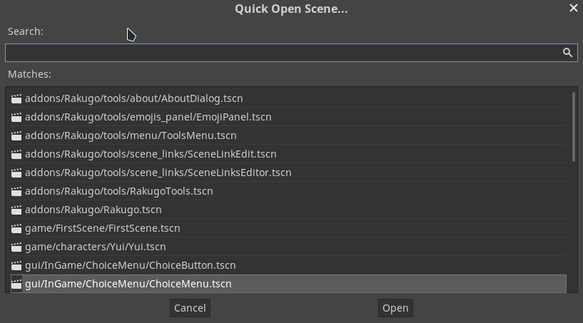
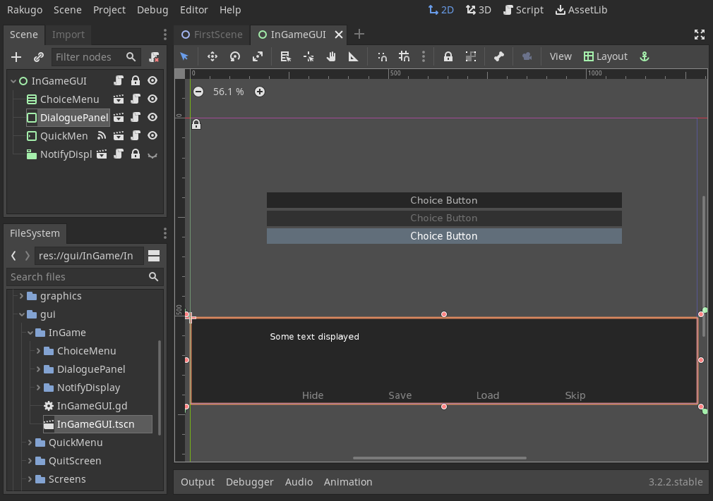
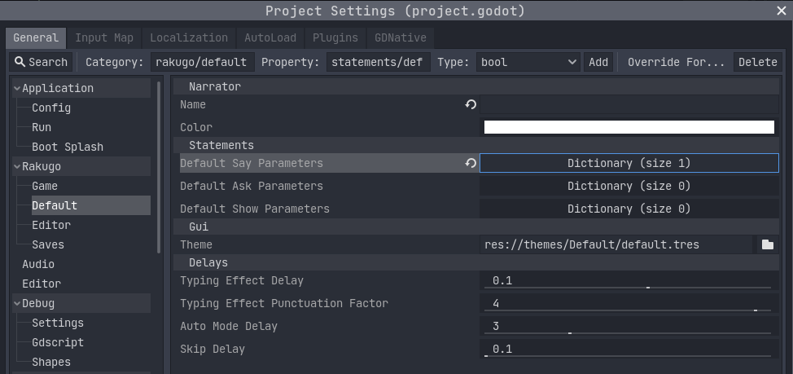
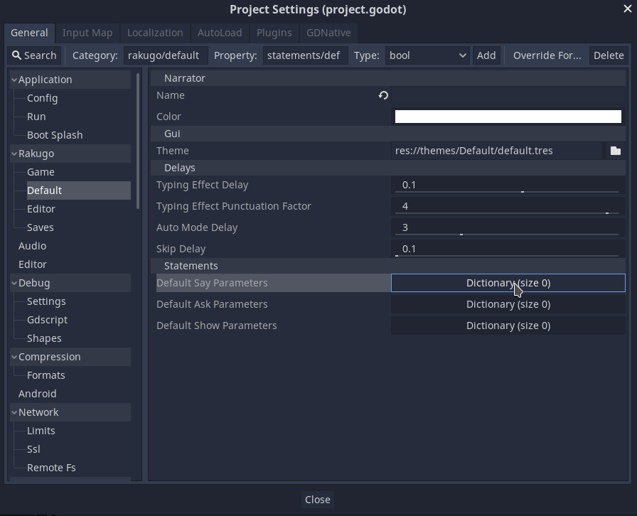

# Adding Multiple Styles of Displaying Dialogue

## Edit GUI Template

This tutorial show you how you can and your own other ways of displaying Dialogues.
For that we need to change gui template and gui is for you to be changed if you need that.

In your project open *gui/InGame/InGameGUI.tscn* scene.

*Tip: You can use short cut `Shift + Ctrl + O`*



Node that handle displaying dialogue is **InGameGUI/DialoguePanel**.



## How This Works ?

If you look into it script you will see that 
you only need to connect your node to signal `"say"`
so it will receive call dialogue `say()` funcs.
```gdscript
Rakugo.connect("say", self, "_on_say")
```

```gdscript
extends PanelContainer

func _ready():
  Rakugo.connect("say", self, "_on_say")
  Rakugo.connect("ask", self, "_on_ask")

func _on_say(_character, _text, _parameters):
  $HideTimer.stop()
  show()

func _on_ask(_default_answer, _parameters):
  $HideTimer.stop()
  show()

func _step():
  $HideTimer.start()

func _on_HideTimer_timeout():
  hide()
```

## Edit Original Script to use Parameters

We need add some way to switch between dialogue displays,
for this we will use parameters. 

```gdscript
extends PanelContainer

# export keyword make possible edit var through Inspector
export var style = "default"

func _ready():
  Rakugo.connect("say", self, "_on_say")
  Rakugo.connect("ask", self, "_on_ask")

func _on_say(_character, _text, _parameters):
  if "style" in _parameters:
    if _parameters.style == style:
      $HideTimer.stop()
      show()

func _on_ask(_default_answer, _parameters):
  if "style" in _parameters:
    if _parameters.style == style:
      $HideTimer.stop()
      show()

func _step():
  $HideTimer.start()

func _on_HideTimer_timeout():
  hide()
```

This code make Rakugo use this dialogue style if it will look like this:
```gdscript
extends Dialogue

func default_style():
  start_event("default_style")

  say(null, "This text show in default dialogue style.", {"style": "default"})
  step()

```

To make it automatic edit **Project Settings**.
Open *Project > Project Settings*.
Then go to *rakugo/default*


Next edit parameters for **Say** and **Ask**.
 

```{note}
Must click on *Add Key/Value Pair* to confirm.
```

## Add Other Style of Display Dialogue

First duplicate **DialoguePanel**.
```{tip}
You can use `Ctrl + D` shortcut for this.
```

Change node name and `style` value.


